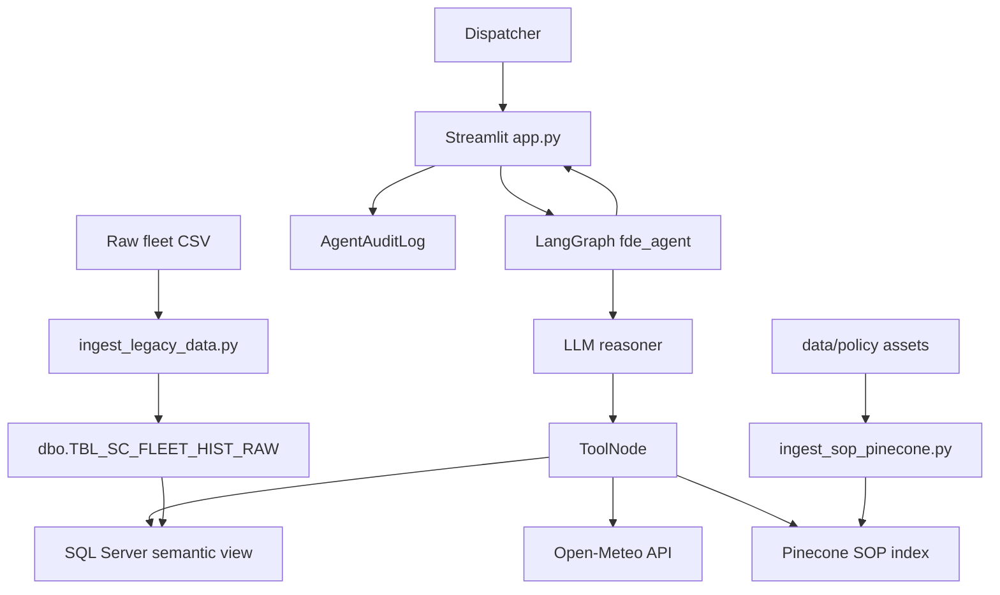

# Thermalink Enterprise Pipeline

An enterprise cold-chain logistics assistant for querying fleet telemetry, live corridor conditions, and cold-chain compliance procedures with natural language.

The project combines:

- A Microsoft SQL Server legacy fleet database.
- A read-only semantic view that isolates the agent from the raw table.
- A LangGraph tool-calling agent.
- A Pinecone vector index for SOP and policy retrieval.
- The Open-Meteo API for current weather conditions.
- A Streamlit dispatch console and audit-log viewer.

The design materials in [Misc/materials/FDE-YT-Project-Business-Presentation.pdf](Misc/materials/FDE-YT-Project-Business-Presentation.pdf) and [Misc/materials/Technical Design Document (TDD)_ Cold-Chain Logistics AI-Assistant.pdf](Misc/materials/Technical%20Design%20Document%20(TDD)_%20Cold-Chain%20Logistics%20AI-Assistant.pdf) describe the intended business and technical architecture. The instructions below are aligned to the Python files that are actually present in this repository.

## 1. What The System Does

A dispatcher asks a question such as:

> Find active shipments near Los Angeles, check local weather, and tell me whether cargo temperature violates the fresh-perishables SOP.

The agent can then:

1. Query `FDE_VIEWS.VW_ACTIVE_FLEET` for telemetry.
2. Call Open-Meteo for current weather at a supplied coordinate.
3. Search indexed policy documents in Pinecone.
4. Synthesize the results into an operational report containing an executive summary, telemetry/environment analysis, action plan, and SOP citation.

The checked-in SOP defines these principal operating rules:

- Fresh perishables must remain between `0.0 C` and `4.0 C`.
- Above `4.0 C` is a critical cold-chain breach; restart auxiliary cooling and use emergency cold storage when the ETA delay exceeds one hour.
- Port congestion above `7.0` suspends standard routing and diverts freight to the Inland Empire Overflow Depot in San Bernardino.
- `High Risk` plus delay probability above `0.65` requires Tier 2 Logistics Manager escalation.

## 2. Architecture



### Main runtime components

| Component | Location | Responsibility |
| --- | --- | --- |
| Streamlit UI | `src/app.py` | Dispatch chat, tool traces, session state, and admin audit-log view. |
| Orchestrator | `src/orchestrator.py` | Creates the LLM, binds tools, and compiles the LangGraph loop. |
| Agent tools | `src/agent_tools.py` | SQL telemetry, live weather, and Pinecone SOP retrieval. |
| Legacy ingestion | `scripts/ingest_legacy_data.py` | Loads the CSV into the legacy SQL table. |
| SOP ingestion | `scripts/ingest_sop_pinecone.py` | Parses, chunks, embeds, and incrementally upserts policy files. |
| Database security | `scripts/setup_security_and_view.sql` | Creates the semantic view and restricted agent login. |
| Agent instructions | `src/prompts/system_prompt.txt` | Defines the desired tool order and business response format. |

## 3. Repository Layout

```text
.
├── data/
│   ├── cache/                  Pinecone ingestion hash cache
│   ├── policy/                 SOP and policy assets indexed into Pinecone
│   └── raw/                    Fleet CSV used by SQL ingestion
├── docs/                       Project setup notes
├── Misc/materials/             Business presentation and technical design PDFs
├── scripts/
│   ├── ingest_legacy_data.py   CSV to SQL Server loader
│   ├── ingest_sop_pinecone.py  Policy parser and Pinecone sync
│   └── setup_security_and_view.sql
├── source/data.txt             Original dataset source URL
├── src/
│   ├── agent_tools.py
│   ├── app.py                  Streamlit entry point
│   ├── orchestrator.py         LangGraph entry point and CLI test loop
│   └── prompts/system_prompt.txt
├── requirements.txt
└── README.md
```

## 4. Prerequisites

This repository was prepared for Python `3.13.15` on macOS ARM64 / Apple Silicon. Other Python versions may work, but are not represented by the pinned dependency file.

Install or provision the following before running the pipeline:

1. Python 3.13.
2. A Python virtual environment.
3. Microsoft ODBC Driver 18 for SQL Server.
4. A reachable SQL Server instance. Local development can use Docker.
5. A Pinecone account and API key.
6. One supported reasoning backend:
	 - Ollama with `qwen2.5:7b` for the local fallback.
	 - OpenAI with an API key.
	 - DeepSeek with an API key.
7. Network access to Pinecone and Open-Meteo.

### Install the SQL Server ODBC driver on macOS

The Python package `pyodbc` is not the SQL Server driver itself. Install Microsoft’s driver and unixODBC separately, for example:

```bash
brew install unixodbc
```

Then install Microsoft ODBC Driver 18 using the current macOS instructions from Microsoft. Confirm that the driver is visible to `pyodbc` before running either SQL script.

## 5. Environment Configuration

Create a `.env` file at the project root. It is ignored by Git and must never be committed.

```dotenv
# SQL Server connection used by ingestion and the agent
SQL_SERVER_HOST=127.0.0.1
SQL_SERVER_PORT=1433
SQL_ADMIN_USER=sa
SQL_ADMIN_PASSWORD=replace-with-admin-password

# Read-only agent connection
SQL_AGENT_USER=USR_FDE_RO
SQL_AGENT_PASSWORD=replace-with-agent-password

# Pinecone
PINECONE_API_KEY=replace-with-pinecone-key

# Embedding mode: LOCAL or OPENAI
Embeddings_model=LOCAL
Local_Embedding_Model=BAAI/bge-m3

# Reasoning mode: OLLAMA, OPENAI, or DEEPSEEK
Agent_llm=OLLAMA
OPENAI_API_KEY=replace-if-using-openai
DEEPSEEK_API_KEY=replace-if-using-deepseek
```

### Model routing

| Setting | Value | Effect |
| --- | --- | --- |
| `Agent_llm` | `OLLAMA` | Uses local Ollama model `qwen2.5:7b`. This is the code default. |
| `Agent_llm` | `OPENAI` | Uses `gpt-4o`. |
| `Agent_llm` | `DEEPSEEK` | Uses `deepseek-v4-flash` through `https://api.deepseek.com`. |
| `Embeddings_model` | `LOCAL` | Uses the Hugging Face model in `Local_Embedding_Model`, default `BAAI/bge-m3`. |
| `Embeddings_model` | `OPENAI` | Uses OpenAI embeddings and the `fde-sop-index-openai` index. |

Do not switch embedding modes against an existing Pinecone index. Local embeddings use `fde-sop-index-local` with dimension `1024`; OpenAI embeddings use `fde-sop-index-openai` with dimension `1536`. The ingestion script validates and recreates an index when its dimension does not match the selected mode.

## 6. Installation

From the repository root:

```bash
python3.13 -m venv .venv
source .venv/bin/activate
python -m pip install --upgrade pip
python -m pip install -r requirements.txt
```

If Ollama is selected, install Ollama separately and pull the configured model:

```bash
ollama pull qwen2.5:7b
```

## 7. Phase 0: Start SQL Server and Load Fleet Data

### 7.1 Start a local SQL Server container

The repository’s SQL scripts assume SQL Server is available on port `1433`. Use a strong local password that satisfies SQL Server password rules:

```bash
docker run \
	-e ACCEPT_EULA=Y \
	-e MSSQL_SA_PASSWORD='replace-with-local-sa-password' \
	-p 1433:1433 \
	--name legacy-mssql \
	-d mcr.microsoft.com/mssql/server:2022-latest
```

Check that the container is running:

```bash
docker ps
docker logs legacy-mssql
```

For persistent local data, add a volume such as `-v mssql_data:/var/opt/mssql`.

### 7.2 Load the raw fleet table

The checked-in loader reads `data/raw/dynamic_supply_chain_logistics_dataset.csv`, selects the telemetry columns, renames them to a legacy schema, adds `SYS_INGEST_FLAG`, and replaces `dbo.TBL_SC_FLEET_HIST_RAW`.

```bash
source .venv/bin/activate
python scripts/ingest_legacy_data.py
```

The SQL admin credentials from `.env` are used for this step. The loader requires the SQL Server ODBC Driver 18 and writes to the `master` database.

Verify the load with a SQL client or VS Code SQL Server extension:

```sql
SELECT COUNT(*) AS total_rows
FROM dbo.TBL_SC_FLEET_HIST_RAW;
```

## 8. Phase 1: Index SOP and Policy Documents

Place supported compliance assets in `data/policy/`. The current repository includes [Cold_Chain_Incident_SOP_v2.md](data/policy/Cold_Chain_Incident_SOP_v2.md). The ingestion script supports `.md`, `.txt`, `.pdf`, `.csv`, and `.xlsx`.

Run:

```bash
python scripts/ingest_sop_pinecone.py
```

The script:

1. Selects local or OpenAI embeddings from `.env`.
2. Creates or validates the matching Pinecone index.
3. Parses Markdown headers, text, PDF pages, or table rows.
4. Splits text into chunks of 600 characters with 60-character overlap.
5. Adds source metadata such as `source_file`, `file_format`, and `document_type`.
6. Upserts chunks in batches of 100.
7. Deletes vectors belonging to removed or replaced files.
8. Stores file MD5 hashes in `data/cache/ingestion_hash_cache.json` so unchanged files are skipped.

The two PDFs in `Misc/materials` are design references, not automatically indexed. Copy a PDF into `data/policy/` only when it should become searchable compliance knowledge.

## 9. Phase 2: Create the Semantic View and Agent Security Boundary

Run [scripts/setup_security_and_view.sql](scripts/setup_security_and_view.sql) as a SQL administrator. It creates:

- Schema `FDE_VIEWS`.
- View `FDE_VIEWS.VW_ACTIVE_FLEET` with business-friendly column names.
- Login/user `USR_FDE_RO`.
- `SELECT` permission on the semantic view.
- Denials against the raw table and destructive operations on `dbo`.

The agent queries only this view, not the raw legacy table. Verify both sides of the boundary using an administrative connection and then the agent connection:

```sql
SELECT TOP 5 *
FROM FDE_VIEWS.VW_ACTIVE_FLEET;

-- This should be denied for USR_FDE_RO:
SELECT TOP 5 *
FROM dbo.TBL_SC_FLEET_HIST_RAW;
```

The SQL file contains a sample password for the database login. Replace it before use in any shared or production environment, and keep the value synchronized with `.env`.

## 10. Phase 3: Run the Agent

### 10.1 CLI smoke test

The orchestrator can be run as an interactive terminal dispatcher:

```bash
python src/orchestrator.py
```

Enter a question at `Dispatcher >`. Type `exit` or `quit` to stop. This path loads `src/prompts/system_prompt.txt` into the graph before accepting questions.

### 10.2 Tool verification

Run the tools directly:

```bash
python src/agent_tools.py
```

This checks a SQL query, the Open-Meteo call for coordinates near Los Angeles, and Pinecone retrieval. Each external dependency must be configured first.

### 10.3 Streamlit dispatch console

The checked-in Streamlit entry point is `src/app.py`:

```bash
streamlit run src/app.py
```

Open the URL printed by Streamlit, normally `http://localhost:8501`.

The console provides:

- `Dispatch Console`: natural-language fleet and compliance questions.
- Tool-call input and raw tool-output expanders.
- Per-browser Streamlit session/thread state.
- A purge button that clears the displayed session and creates a new thread ID.
- `Security & Audit Logs`: admin-authenticated display of `FDE_VIEWS.AgentAuditLog`.

The older notes in `docs/instructions.md` refer to `src/ui.py`; that file is not present in this checkout. Use `src/app.py`.

## 11. Phase 4: Enable Audit Logging

The Streamlit app writes agent traces to `FDE_VIEWS.AgentAuditLog`. Create the table as an administrator and grant only insert access to the agent user:

```sql
CREATE TABLE FDE_VIEWS.AgentAuditLog (
		LogID INT IDENTITY(1,1) PRIMARY KEY,
		Timestamp DATETIME DEFAULT GETDATE(),
		SessionID VARCHAR(50),
		NodeExecuted VARCHAR(50),
		ToolName VARCHAR(100),
		Content NVARCHAR(MAX)
);

GRANT INSERT ON FDE_VIEWS.AgentAuditLog TO USR_FDE_RO;
```

The audit screen uses `SQL_ADMIN_USER` and the password entered in the form. Add these optional variables to `.env` for the prefilled username:

```dotenv
SQL_ADMIN_USER=replace-with-audit-reader
SQL_ADMIN_PASSWORD=replace-with-audit-reader-password
```

Do not grant broad write or schema permissions to the agent account. The app intentionally treats audit write failures as non-fatal and prints a warning instead of stopping the dispatch response.

## 12. Recommended Verification Questions

Use these after SQL, Pinecone, and the selected LLM are available:

```text
Find any active shipments near Los Angeles (latitude about 33.8, longitude about -118.1). Check the local weather there, and tell me if the current cargo temperature violates the SOP for fresh perishables.
```

```text
I'm a new dispatcher on the night shift. Explain the difference between a Tier 1 and Tier 2 escalation.
```

The first should exercise telemetry, weather, and SOP retrieval. The second is useful for checking how the selected model handles a question that may not require external tools.

## 13. Troubleshooting

### `PINECONE_API_KEY` is missing

Confirm that `.env` is at the repository root and that the key is named exactly `PINECONE_API_KEY`. Both `src/agent_tools.py` and the SOP ingestion script fail fast without it.

### SQL connection or `pyodbc` errors

Check that:

1. `docker ps` shows `legacy-mssql` running.
2. `SQL_SERVER_HOST` and `SQL_SERVER_PORT` point to the SQL Server instance.
3. ODBC Driver 18 is installed and visible to the operating system.
4. The credentials match the SQL login being used.
5. The raw table and `FDE_VIEWS.VW_ACTIVE_FLEET` exist.

### Pinecone dimension mismatch

Use the same `Embeddings_model` value for ingestion and runtime. The local and OpenAI indexes intentionally have different names and dimensions.

### Ollama model errors

Start Ollama and run `ollama pull qwen2.5:7b`, or switch `Agent_llm` to `OPENAI` or `DEEPSEEK` and provide the matching API key.

### No SOP matches are returned

Confirm that the policy file is under `data/policy/`, rerun `python scripts/ingest_sop_pinecone.py`, and check that the selected embedding mode has not changed since ingestion.

### Audit logs do not appear

Create `FDE_VIEWS.AgentAuditLog`, grant `INSERT` to `USR_FDE_RO`, and verify that the Streamlit process can connect with the agent credentials. Audit failures do not prevent the main response from rendering.

## 14. Deployment Notes

For an EC2 deployment, the design documents recommend exposing the Streamlit application on port `8501` while keeping SQL Server port `1433` private to the application host’s security group. Install Python, the Microsoft ODBC Driver 18, and the project dependencies on the instance, then run:

```bash
streamlit run src/app.py --server.port=8501 --server.address=0.0.0.0
```

For a persistent service, use a process manager such as `systemd`. Set `WorkingDirectory` to the repository root and point `ExecStart` to the virtual environment’s `streamlit` executable. Store `.env` outside source control and rotate all example credentials before deployment.

## 15. Known Implementation Notes

- `src/app.py` is the current UI entry point; `src/ui.py` mentioned in older notes does not exist.
- `scripts/ingest_legacy_data.py` uses `data/raw/dynamic_supply_chain_logistics_dataset.csv`; `source/data.txt` contains the original dataset URL only.
- The Streamlit app imports the compiled orchestrator directly. The CLI explicitly loads `src/prompts/system_prompt.txt`; review this distinction before treating the prompt file as active in every UI request.
- `src/agent_tools.py` limits SQL tool execution to statements whose trimmed text starts with `SELECT`; the database permissions provide the deeper enforcement boundary.
- The local Hugging Face embedding model runs on CPU by default and may take time and memory on its first load.

## License

See [LICENSE](LICENSE).